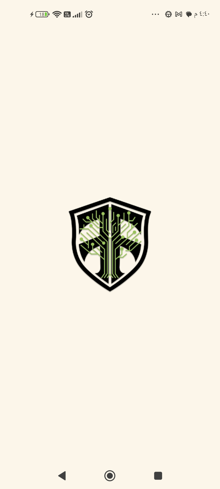
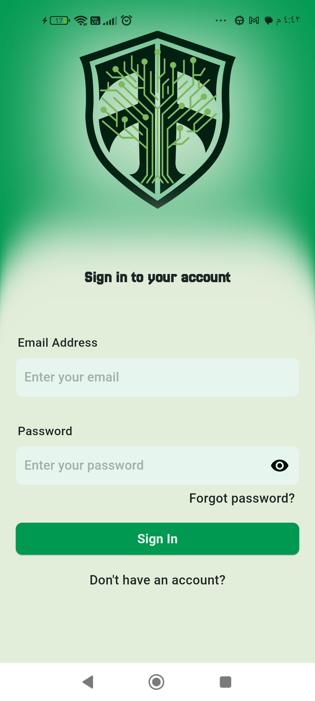
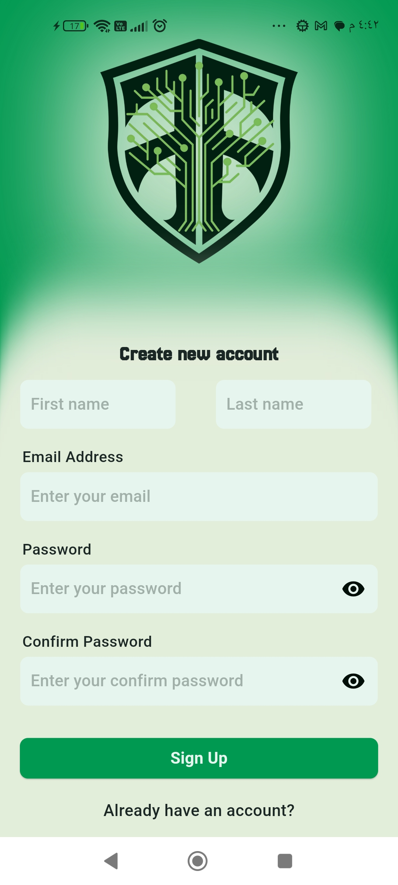
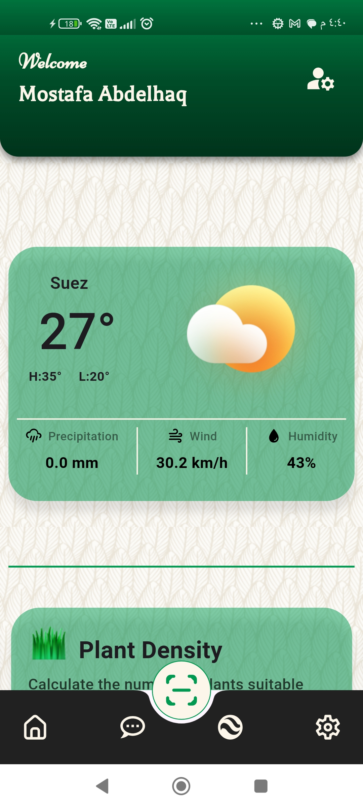
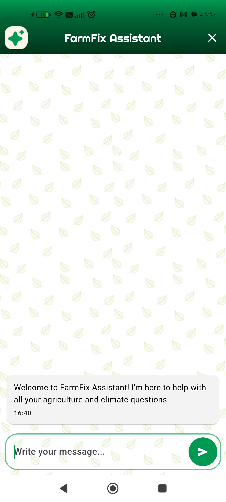
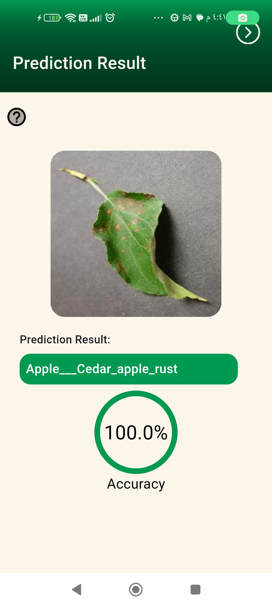
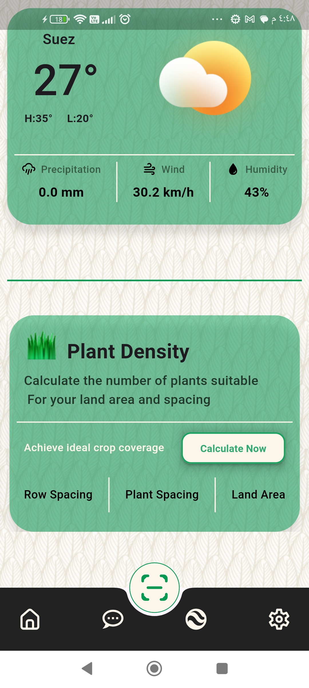
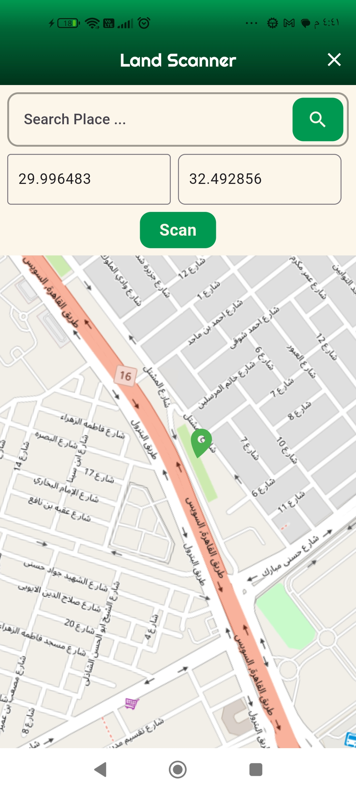
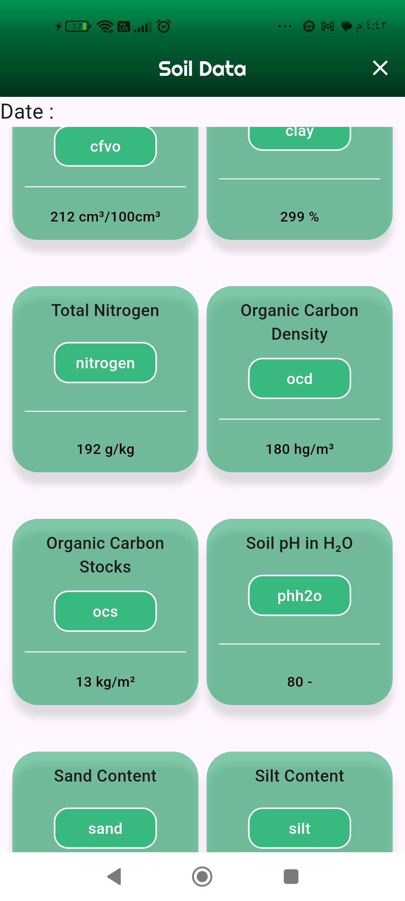

# 🌿 FarmFix – Your Smart Farming Companion

FarmFix is a mobile app that uses AI and satellite soil data to help farmers detect plant diseases, analyze soil composition, and get instant agricultural advice through a specialized chatbot.

Table of Contents
About The Project
Features
Screenshots
Getting Started
Prerequisites
Installation
Usage
Technologies Used
Contributing
License
Contact
About The Project
In the world of agriculture, early detection of plant diseases and informed decision-making about soil conditions are crucial for maximizing yield and minimizing losses. FarmFix aims to be a farmer's best companion, offering a comprehensive suite of features to address these challenges.

This application leverages cutting-edge technology to provide solutions for:

Plant Disease Detection: Identify plant diseases quickly and accurately by simply scanning a leaf.
Agricultural Chatbot: Get instant, specialized answers to all your farming and climate-related questions.
Soil Data Analysis: Understand your land's composition and characteristics using advanced API integrations.
Our goal is to make advanced agricultural insights accessible to everyone, helping to cultivate healthier crops and more productive farms. 🚜

Features
🌿 Plant Disease Detection: Snap a photo of a plant leaf and get an instant prediction of potential diseases, along with accuracy.
💬 FarmFix Assistant (Chatbot): A dedicated AI chatbot specialized in agriculture and climate, ready to answer your queries 24/7.
🌍 Land Scanner & Soil Data: Utilize the SoilGrids API to fetch detailed soil composition data for specific geographical coordinates.
🔢 Agricultural Calculators: Tools like the Plant Density calculator help you optimize planting for your land area and spacing.
☀️ Real-time Weather Updates: Get current weather conditions for your location, including temperature, precipitation, wind speed, and humidity.
👤 User Authentication: Secure sign-up and sign-in functionality to manage your profile.
⚙️ User Settings: Customize your app experience, including language preferences.
## Screenshots

| Splash Screen                                        | Sign In Screen                                       | Sign Up Screen                                       |
| :--------------------------------------------------- | :--------------------------------------------------- | :--------------------------------------------------- |
|       |     |     |

| Home Screen                                          | Chatbot Screen                                       | Prediction Result Screen                             |
| :--------------------------------------------------- | :--------------------------------------------------- | :--------------------------------------------------- |
|           |     |  |

| Calculators Screen                                   | Map Screen (Land Scanner)                            | Soil Data Screen                                     |
| :--------------------------------------------------- | :--------------------------------------------------- | :--------------------------------------------------- |
|    |             |  |

Getting Started
To get a local copy up and running, follow these simple steps.

Prerequisites
This project is built with Flutter. Ensure you have Flutter installed on your system.

Flutter SDK
Dart SDK
A suitable IDE (e.g., VS Code with Flutter plugin, Android Studio)
Installation
Clone the repo:

git clone https://github.com/mostafaabdelhqq/FarmFix.git
Navigate into the project directory:

cd FarmFix
Install Flutter dependencies:

flutter pub get
Set up environment variables:
You will need to set up API keys for services like the SoilGrids API (if directly called from the client or through a backend). For sensitive keys, consider using a .env file or environment variables.
Self-correction: For the SoilGrid API, it seems to be integrated in the backend/model. If there are client-side keys, mention them. For now, let's assume backend handles it. If not, add instructions for API keys.
Run the application:

flutter run
Usage
Once the application is running:

Sign Up/Sign In: Create an account or log in to access all features.
Home Screen: View current weather data and access the Plant Density calculator.
Plant Disease Detection: Navigate to the prediction feature, take a picture of a leaf, and get an instant disease diagnosis. 📸
FarmFix Assistant: Tap on the chatbot icon to start a conversation and ask any agricultural questions.
Land Scanner: Use the map to input coordinates or search for a place to retrieve detailed soil data.
Settings: Customize app preferences and manage your account.
## ⚙️ Technologies Used

### Frontend
- Flutter (Dart)
- Dio (Networking)
- Cubit (State Management)
- Firebase Auth
- SharedPreferences

### Backend / ML
- SoilGrids API (Soil Analysis)
- Google Gemini API (AI Chatbot)
- TensorFlow Lite (Plant Disease Detection Model)

Contributions are what make the open-source community such an amazing place to learn, inspire, and create. Any contributions you make are greatly appreciated.

If you have a suggestion that would make this better, please fork the repo and create a pull request. You can also simply open an issue with the tag "enhancement". Don't forget to give the project a star! ⭐️

Fork the Project
Create your Feature Branch (git checkout -b feature/AmazingFeature)
Commit your Changes (git commit -m 'Add some AmazingFeature')
Push to the Branch (git push origin feature/AmazingFeature)
Open a Pull Request
License
Distributed under the MIT License. See LICENSE.txt for more information.

Contact
Mostafa Abdelhaq - 3b7a299@gmail.com
Project Link: https://github.com/mostafaabdelhqq/FarmFix
